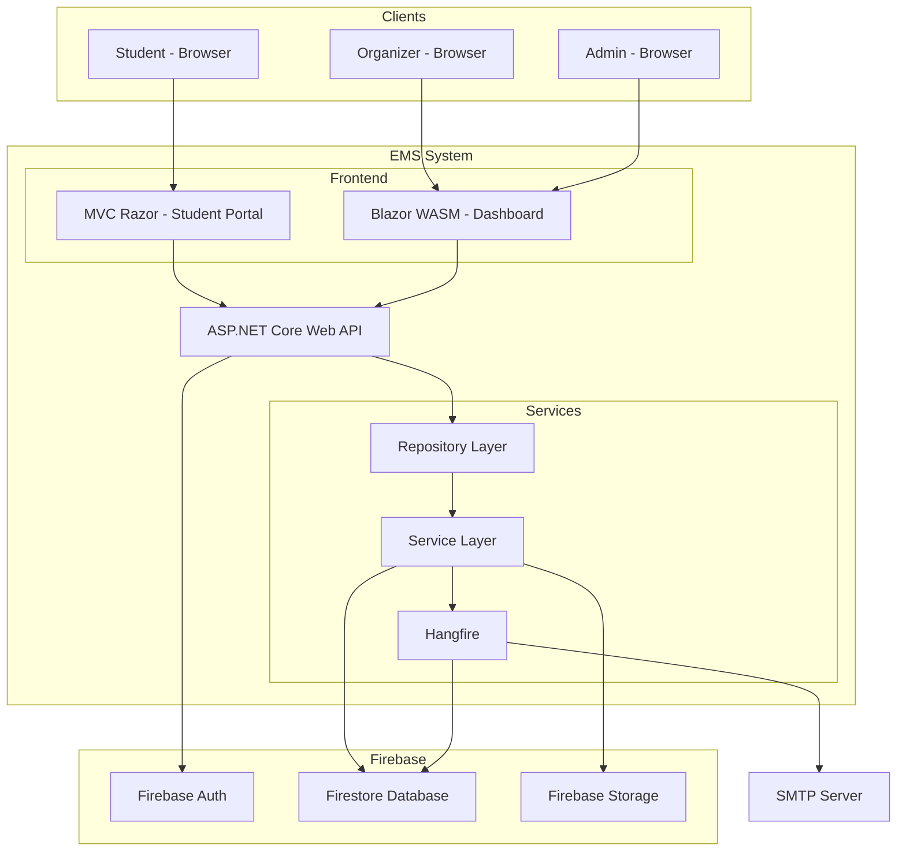
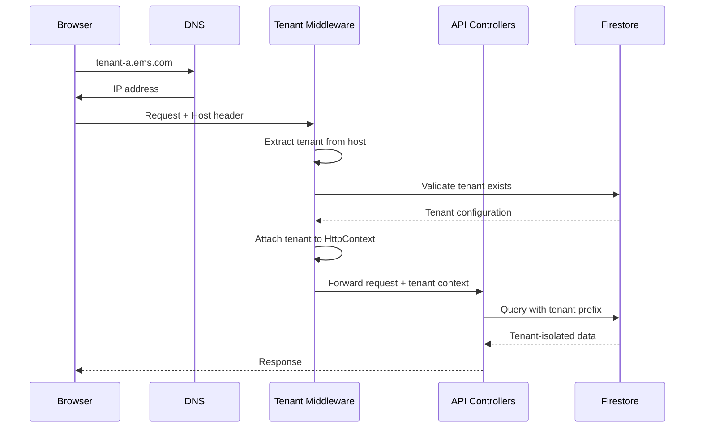
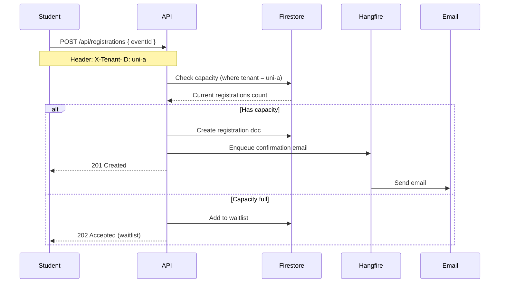

# Tổng quan Kiến trúc Hệ thống EMS

## 1. Mục tiêu

Xây dựng hệ thống quản lý sự kiện **đa nền tảng (multi-tenant)** có thể phục vụ cho nhiều trường đại học, tổ chức khác nhau. Hệ thống cho phép mỗi tổ chức (tenant) có không gian dữ liệu riêng, cấu hình riêng và giao diện tùy chỉnh theo thương hiệu.

### 1.1 Mục tiêu cụ thể
- Sinh viên dễ dàng tìm kiếm, đăng ký và điểm danh sự kiện
- Ban tổ chức quản lý người tham gia, điểm danh tự động, xuất báo cáo
- Quản trị viên hệ thống giám sát toàn bộ các tenant
- Hỗ trợ mở rộng thêm tenant mới mà không cần thay đổi code

## 2. Các Quyết định Kiến trúc Quan trọng

### 2.1 Multi-tenant Strategy
| Quyết định | Lựa chọn | Lý do |
|------------|----------|-------|
| **Tenant identification** | Subdomain (tenant.ems.com) | Dễ nhận biết, dễ cấu hình DNS, không cần sửa code |
| **Database isolation** | Collection prefix (`{tenantId}/`) | Firebase không hỗ trợ database riêng, dùng prefix để isolate |
| **Tenant configuration** | Firestore document per tenant | Linh hoạt, dễ thay đổi runtime |

### 2.2 Database
| Quyết định | Lựa chọn | Lý do |
|------------|----------|-------|
| **Database provider** | Firebase Firestore | Real-time, built-in auth, storage, serverless, giảm chi phí vận hành |
| **Data modeling** | NoSQL (collection/document) | Phù hợp với truy vấn theo tenant, dễ mở rộng |
| **Security model** | Firebase Security Rules | Kiểm soát truy cập ở tầng database |

### 2.3 Backend Framework
| Quyết định | Lựa chọn | Lý do |
|------------|----------|-------|
| **API Framework** | ASP.NET Core 6 | Hiệu năng cao, cộng đồng lớn, dễ tích hợp Firebase |
| **Architecture pattern** | Repository Pattern + Service Layer | Tách biệt business logic, dễ test, dễ bảo trì |
| **Background jobs** | Hangfire | Dashboard quản lý, retry policy, recurring jobs |

### 2.4 Frontend
| Quyết định | Lựa chọn | Lý do |
|------------|----------|-------|
| **Student portal** | MVC Razor + Bootstrap 5 | SEO tốt, tải nhanh, dễ triển khai |
| **Admin/Organizer dashboard** | Blazor WebAssembly | Tương tác cao, real-time, chia sẻ code với backend |
| **Branding per tenant** | Dynamic CSS + Logo upload | Mỗi tenant có thể tùy chỉnh màu sắc, logo |

### 2.5 Authentication
| Quyết định | Lựa chọn | Lý do |
|------------|----------|-------|
| **Identity provider** | Firebase Authentication | Tích hợp sẵn với Firestore, hỗ trợ multi-tenant |
| **Authorization** | Custom claims (tenantId, role) | Phân quyền theo tenant và role |
| **Session management** | JWT (stored in cookie/localStorage) | Stateless, dễ mở rộng |

### 2.6 Testing Strategy
| Quyết định | Lựa chọn | Lý do |
|------------|----------|-------|
| **Test responsibility** | Developer tự viết test | Agent chỉ liệt kê test case |
| **Test types** | Unit tests + Integration tests | Đảm bảo chất lượng code |
| **Test data** | Firebase Emulator Suite | Chạy test không ảnh hưởng production |

### 2.7 Development Tools
| Quyết định | Lựa chọn | Lý do |
|------------|----------|-------|
| **Code intelligence** | CodeGraph | Agent hiểu sâu cấu trúc code, phân tích tác động |
| **UI quality** | Taste-Skill | Đảm bảo giao diện đẹp, không generic |
| **Version control** | GitHub | Quản lý source, CI/CD, collaboration |

## 3. Sơ đồ Kiến trúc Tổng thể



## 4. Luồng Dữ liệu Chính

### 4.1 Tenant Identification Flow



### 4.2 Registration Flow (Multi-tenant)



## 5. Bảo mật Multi-tenant

### 5.1 Firebase Security Rules

```javascript
rules_version = '2';
service cloud.firestore {
  match /databases/{database}/documents {
    // Tenant isolation - mọi document phải bắt đầu bằng tenantId
    match /{tenantId}/{document=**} {
      allow read, write: if request.auth != null 
        && request.auth.uid != null
        && request.auth.token.tenantId == tenantId
        && request.auth.token.role in ['admin', 'organizer', 'student'];
    }
  
    // Users collection đặc biệt (global, không cần tenant prefix)
    match /users/{userId} {
      allow read: if request.auth != null && request.auth.uid == userId;
      allow write: if request.auth != null && request.auth.uid == userId;
    }
  }
}
```

### 5.2 JWT Claims Structure

```json
{
  "uid": "firebase-user-id",
  "email": "student@university.edu",
  "tenantId": "university-a",
  "role": "student",
  "mssv": "202312345",
  "iat": 1698765432,
  "exp": 1698851832
}
```

## 6. Giới hạn và Rủi ro

| Rủi ro                                              | Mức độ   | Giảm thiểu                                                 |
| ---------------------------------------------------- | ----------- | ------------------------------------------------------------ |
| Firebase query giới hạn (1 triệu docs/collection) | Thấp       | Thiết kế sharding theo thời gian cho registrations        |
| Firestore pricing (reads/writes)                     | Trung bình | Cache dữ liệu nóng bằng Redis (tùy chọn)               |
| Quota Firestore (500 writes/second)                  | Thấp       | Hàng đợi Hangfire cho write-heavy operations              |
| Tenant isolation phụ thuộc vào Security Rules     | Cao         | Kiểm tra kỹ rules trước production, có integration test |
| Subdomain DNS propagation                            | Thấp       | Hỗ trợ fallback: X-Tenant-ID header                        |

## 7. Mở rộng Tương lai

| Tính năng          | Thời điểm | Ghi chú                                                              |
| -------------------- | ------------ | --------------------------------------------------------------------- |
| Redis cache          | Phase 10+    | Giảm read cost Firebase                                              |
| Webhook cho tenant   | Phase 10+    | Tenant tự xử lý sự kiện (gửi SMS, tích hợp hệ thống riêng) |
| Tenant marketplace   | Future       | Cho phép tenant publish sự kiện lên marketplace chung             |
| Mobile app (Flutter) | Future       | Reuse Firebase setup, chỉ cần xây dựng UI mới                    |

---
