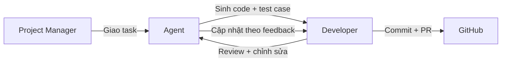

# Quy trình Làm việc Chuẩn cho AI Agent

## 1. Nguyên tắc làm việc

### 1.1 Vai trò của Agent
- Agent là người **hỗ trợ lập trình**, không thay thế hoàn toàn developer.
- Agent sinh code, test case, tài liệu dựa trên task được giao.
- Developer chịu trách nhiệm code review, integration, và viết test.

### 1.2 Quy trình 7 bước (rút gọn từ 8 bước)

| Bước | Tên | Mô tả | Output |
|------|-----|-------|--------|
| 1 | **Analyze** | Đọc task, xác định phạm vi ảnh hưởng | Phân tích ngắn (3-5 dòng) |
| 2 | **Design** | Thiết kế class, interface, method | Pseudo-code hoặc class diagram |
| 3 | **Generate Code** | Viết code hoàn chỉnh | Code files |
| 4 | **Self Review** | Tự kiểm tra lỗi logic, naming, security | Báo cáo review |
| 5 | **Generate Test Cases** | Liệt kê test case (không viết code test) | Danh sách test case |
| 6 | **Refactor** | Tối ưu code (nếu cần) | Code đã refactor |
| 7 | **Update Documentation** | Cập nhật tài liệu liên quan | Documentation commits |

**Lưu ý:** Agent **không viết unit test code**. Chỉ liệt kê test case.

---

## 2. Input / Output format

### 2.1 Input Agent nhận được

```markdown
## Task: [Mã Task]
**Mô tả:** [Nội dung task]
**File cần sửa:** [Đường dẫn file]
**Dependencies:** [Các task phải hoàn thành trước]
**Acceptance Criteria:**
- [ ] Tiêu chí 1
- [ ] Tiêu chí 2
```

### 2.2 Output Agent phải trả về

```markdown
## Task Report: [Mã Task]

### 1. Analysis
[Phân tích ngắn gọn]

### 2. Design
[Pseudo-code hoặc mô tả design]

### 3. Generated Code
[Code files hoặc link đến file]

### 4. Self Review
- [x] Logic đúng
- [x] Naming convention
- [x] Security (không lộ secret, có validation)
- [x] Performance (không N+1 query)

### 5. Test Cases
| ID | Mô tả | Input mong đợi | Output mong đợi |
|----|-------|----------------|-----------------|
| TC-XXX-01 | ... | ... | ... |

### 6. Documentation Updated
- [ ] Cập nhật Swagger comment
- [ ] Cập nhật README (nếu cần)

### 7. Checklist
- [ ] Code build thành công
- [ ] Không phá vỡ API cũ
- [ ] Đã thêm validation (nếu cần)
```

---

## 3. Code Quality Checklist (Self Review)

### 3.1 General

- [ ] Không hard-code string, số, connection string
- [ ] Sử dụng async/await cho I/O operations (Firestore, HTTP, file)
- [ ] Xử lý exception (try-catch ở service layer, không để exception bắn ra controller)
- [ ] Logging quan trọng (Serilog)

### 3.2 API (Controller)

- [ ] Có `[Authorize]` attribute nếu cần xác thực
- [ ] Có `[ProducesResponseType]` cho Swagger
- [ ] Validate model state (`if (!ModelState.IsValid)`)
- [ ] Trả về đúng status code (200, 201, 400, 401, 403, 404, 500)
- [ ] Response có cấu trúc chuẩn: `{ success, data, message }`

### 3.3 Service Layer

- [ ] Interface được đặt tên theo chuẩn (I{Name}Service)
- [ ] Method có XML comment (`<summary>`, `<param>`, `<returns>`)
- [ ] Không gọi trực tiếp Firestore từ service (dùng repository)
- [ ] Business logic rõ ràng, không trộn với mapping

### 3.4 Repository (Firestore)

- [ ] Sử dụng `FirestoreDb` từ dependency injection
- [ ] Query có filter theo `TenantId`
- [ ] Sử dụng `AsNoTracking()` tương đương (không cache document)
- [ ] Có phân trang (limit, offset)

### 3.5 Entity / DTO

- [ ] Entity có `TenantId` (trừ user global)
- [ ] DTO có validation attributes (nếu dùng FluentValidation)
- [ ] Không expose entity ra API (dùng DTO)

---

## 4. Test Case Generation Rules

### 4.1 Cấu trúc test case

| Trường                  | Mô tả                         | Ví dụ                               |
| ------------------------- | ------------------------------- | ------------------------------------- |
| **ID**              | Mã duy nhất                   | TC-REG-001                            |
| **Title**           | Tên test case                  | Đăng ký thành công khi còn chỗ |
| **Preconditions**   | Điều kiện trước            | Sự kiện có capacity=10, current=5  |
| **Steps**           | Các bước thực hiện         | 1. Gọi API POST /registrations       |
| **Expected Result** | Kết quả mong đợi            | HTTP 201, registration.created=true   |
| **Actual Result**   | (để trống, developer điền) |                                       |
| **Status**          | (để trống)                   | Pass/Fail                             |

### 4.2 Số lượng test case tối thiểu cho mỗi feature

| Loại feature | Số test case tối thiểu                             |
| ------------- | ----------------------------------------------------- |
| GET (read)    | 3 (success, not found, unauthorized)                  |
| POST (create) | 4 (success, validation fail, duplicate, unauthorized) |
| PUT (update)  | 4 (success, not found, validation, unauthorized)      |
| DELETE        | 3 (success, not found, unauthorized)                  |

### 4.3 Ví dụ test case (cho API đăng ký)

```markdown
### TC-REG-001: Đăng ký thành công (còn chỗ)
- **Preconditions:** Event E01 capacity=10, registrations=5, student chưa đăng ký
- **Steps:** POST /api/registrations { studentId: "S01", eventId: "E01" }
- **Expected:** 201 Created, registration status = Approved, currentRegistrations = 6

### TC-REG-002: Đăng ký thất bại (hết chỗ)
- **Preconditions:** Event E02 capacity=10, registrations=10
- **Steps:** POST /api/registrations { studentId: "S02", eventId: "E02" }
- **Expected:** 400 Bad Request, message "Event is full"

### TC-REG-003: Đăng ký thất bại (đã đăng ký trước đó)
- **Preconditions:** Student S03 đã đăng ký event E03
- **Steps:** POST /api/registrations { studentId: "S03", eventId: "E03" }
- **Expected:** 409 Conflict, message "Already registered"

### TC-REG-004: Đăng ký thất bại (quá giới hạn cá nhân)
- **Preconditions:** Tenant setting maxRegistrationsPerStudent = 5, student đã đăng ký 5 events
- **Steps:** POST /api/registrations { studentId: "S04", eventId: "E04" }
- **Expected:** 400 Bad Request, message "Exceeded registration limit"
```

---

## 5. Mỗi quan hệ giữa Agent và Developer



**Nguyên tắc:**

- Agent không tự động commit code. Developer là người commit.
- Agent có thể tạo pull request (nếu được cấu hình), nhưng cần được review.
- Developer có quyền từ chối code của Agent nếu không đạt chất lượng.

---

## 6. Exception Handling Guideline

### 6.1 Các loại exception cần bắt

| Exception                               | Xử lý                                     |
| --------------------------------------- | ------------------------------------------- |
| `FirebaseException`                   | Log error, trả về 503 Service Unavailable |
| `ArgumentException`                   | Trả về 400 Bad Request                    |
| `UnauthorizedAccessException`         | Trả về 403 Forbidden                      |
| `NotFoundException` (custom)          | Trả về 404 Not Found                      |
| `ConcurrencyException` (cho waitlist) | Retry (tối đa 3 lần)                     |

### 6.2 Custom exception classes

```csharp
// Core/Exceptions/
public class NotFoundException : Exception { }
public class BusinessRuleException : Exception { }
public class ConcurrencyException : Exception { }
public class TenantNotFoundException : Exception { }
```

### 6.3 Global exception middleware

```csharp
// WebAPI/Middlewares/GlobalExceptionMiddleware.cs
public async Task InvokeAsync(HttpContext context)
{
    try
    {
        await _next(context);
    }
    catch (NotFoundException ex)
    {
        context.Response.StatusCode = 404;
        await context.Response.WriteAsJsonAsync(new { success = false, message = ex.Message });
    }
    catch (BusinessRuleException ex)
    {
        context.Response.StatusCode = 400;
        await context.Response.WriteAsJsonAsync(new { success = false, message = ex.Message });
    }
    catch (Exception ex)
    {
        _logger.LogError(ex, "Unhandled exception");
        context.Response.StatusCode = 500;
        await context.Response.WriteAsJsonAsync(new { success = false, message = "Internal server error" });
    }
}
```

---

## 7. Git Workflow cho Agent

### 7.1 Branch naming convention

```
feature/{phase}-{task-id}-{short-description}
Ví dụ: feature/p3-e3-f1-t1-register-api
```

### 7.2 Commit message convention (Conventional Commits)

```
<type>(<scope>): <subject>

Types:
- feat: tính năng mới
- fix: sửa lỗi
- docs: tài liệu
- refactor: tái cấu trúc (không thay đổi hành vi)
- test: thêm test case (chỉ liệt kê, không code test)
- chore: build, config, dependency

Ví dụ:
feat(api): add registration endpoint
docs(swagger): update event schema
refactor(service): extract waitlist logic
```

### 7.3 Pull request template

```markdown
## Task ID
P3_E3_F1_T1

## Changes
- [ ] Thêm endpoint POST /api/registrations
- [ ] Thêm RegistrationService.RegisterAsync()
- [ ] Thêm validation

## Test Cases
- TC-REG-001: Register success
- TC-REG-002: Register full capacity

## Checklist
- [ ] Code tự review
- [ ] Build thành công
- [ ] Không breaking change
- [ ] Cập nhật Swagger

## Screenshots (nếu UI)
[link ảnh]
```

---

## 8. Các lệnh Agent cần biết (terminal)

```bash
# Build solution
dotnet build EMS.sln

# Run (WebAPI)
dotnet run --project EMS.WebAPI

# Run (MVC)
dotnet run --project EMS.Mvc

# Run (Blazor WASM - cần hosting hoặc standalone)
dotnet run --project EMS.BlazorWASM

# Firebase emulator
firebase emulators:start

# Deploy Firebase rules
firebase deploy --only firestore:rules
```
