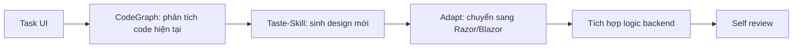
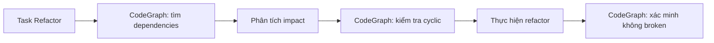

# Hướng dẫn Cài đặt và Cấu hình CodeGraph & Taste-Skill

## 1. Giới thiệu

| Công cụ | Mục đích | Sử dụng cho |
|---------|----------|-------------|
| **CodeGraph** | Xây dựng bản đồ tri thức về code, phân tích dependency, tác động thay đổi | Agent hiểu cấu trúc dự án, tìm kiếm symbol, phân tích ảnh hưởng khi refactor |
| **Taste-Skill** | Bộ kỹ năng frontend, sinh giao diện chất lượng cao, không generic | Agent tạo UI/UX đẹp, hiện đại, không bị "nhàm chán" |

## 2. CodeGraph

### 2.1 Yêu cầu hệ thống

- Node.js 18+ (cho MCP server)
- Python 3.9+ (cho codegraph core)
- Git

### 2.2 Cài đặt

**macOS / Linux:**
```bash
curl -fsSL https://raw.githubusercontent.com/colbymchenry/codegraph/main/install.sh | sh
```

**Windows (PowerShell as Administrator):**

```powershell
irm https://raw.githubusercontent.com/colbymchenry/codegraph/main/install.ps1 | iex
```

**Xác minh cài đặt:**

```bash
codegraph --version
```

### 2.3 Khởi tạo cho dự án EMS

```bash
cd /path/to/EMS
codegraph init -i
```

Lệnh này sẽ:

- Tạo file `.codegraph/config.yml`
- Phân tích cấu trúc thư mục
- Xác định ngôn ngữ (.NET C#)

### 2.4 Cấu hình `.codegraph/config.yml`

```yaml
project:
  name: EMS
  language: csharp
  root: .

ignore:
  - "**/bin/**"
  - "**/obj/**"
  - "**/node_modules/**"
  - "**/.git/**"

index:
  include:
    - "EMS.Core/**/*.cs"
    - "EMS.Infrastructure/**/*.cs"
    - "EMS.WebAPI/**/*.cs"
    - "EMS.Mvc/**/*.cs"
    - "EMS.BlazorWASM/**/*.cs"
  exclude:
    - "**/Migrations/**"

symbols:
  track:
    - class
    - interface
    - method
    - property
    - field

relationships:
  - inheritance
  - invocation
  - field_reference
  - return_type
```

### 2.5 Xây dựng Code Graph

```bash
codegraph build
```

Lệnh này sẽ quét toàn bộ codebase và tạo đồ thị knowledge graph.

### 2.6 Sử dụng Code Graph cho Agent

#### Truy vấn tìm kiếm symbol

```bash
# Tìm tất cả class có chứa "Service"
codegraph query "class: *Service"

# Tìm method của EventService
codegraph query "method: EventService.*"

# Tìm dependency của RegistrationService
codegraph deps RegistrationService

# Tìm nơi sử dụng IEventRepository
codegraph usages IEventRepository
```

#### Phân tích tác động khi thay đổi

```bash
# Xem ảnh hưởng khi sửa Event entity
codegraph impact Event.cs

# Tìm cyclic dependencies
codegraph cycle
```

#### Export graph để visualize

```bash
# Export ra file dot (Graphviz)
codegraph export --format dot > graph.dot

# Convert sang hình ảnh
dot -Tpng graph.dot -o graph.png
```

### 2.7 Tích hợp với AI Agent (MCP Server)

CodeGraph có thể chạy như MCP server để Agent gọi trực tiếp:

```bash
codegraph serve --port 8765
```

Agent sẽ gọi API:

```http
POST http://localhost:8765/query
Content-Type: application/json

{
  "type": "dependencies",
  "symbol": "EventService"
}
```

Response:

```json
{
  "dependencies": [
    "IEventRepository",
    "IEmailService",
    "IRegistrationRepository"
  ],
  "dependents": [
    "EventsController",
    "EventApprovalJob"
  ]
}
```

## 3. Taste-Skill

### 3.1 Giới thiệu

Taste-Skill là bộ kỹ năng (skills) cho AI Agent, giúp sinh giao diện frontend có chất lượng thẩm mỹ cao, không bị "generic" hay "nhàm chán". Nó dựa trên các nguyên tắc design hiện đại và các mẫu UI phổ biến.

### 3.2 Cài đặt

**Yêu cầu:** Node.js 18+, đã cài `skills` CLI (từ `@modelcontextprotocol/sdk`)

```bash
# Cài skill CLI
npm install -g @modelcontextprotocol/sdk

# Cài toàn bộ taste-skill
npx skills add https://github.com/Leonxlnx/taste-skill

# Hoặc cài từng skill riêng
npx skills add https://github.com/Leonxlnx/taste-skill --skill "design-taste-frontend"
npx skills add https://github.com/Leonxlnx/taste-skill --skill "redesign-existing-projects"
npx skills add https://github.com/Leonxlnx/taste-skill --skill "create-landing-page"
```

### 3.3 Danh sách skills có sẵn

| Skill                          | Mô tả                                                           | Sử dụng cho                 |
| ------------------------------ | ----------------------------------------------------------------- | ----------------------------- |
| `design-taste-frontend`      | Thiết kế giao diện frontend tổng thể với layout hiện đại | Dashboard, trang chủ, form   |
| `redesign-existing-projects` | Tái cấu trúc giao diện có sẵn để đẹp hơn               | Cải thiện UI cũ            |
| `create-landing-page`        | Tạo landing page cho sự kiện                                   | Trang giới thiệu sự kiện  |
| `design-responsive-layout`   | Tạo layout responsive cho mobile/tablet                          | Tối ưu giao diện di động |
| `design-dark-mode`           | Thiết kế chế độ tối                                         | Dark mode toggle              |

### 3.4 Sử dụng trong Prompt cho Agent

#### Ví dụ 1: Tạo Organizer Dashboard

```markdown
Hãy sử dụng Taste-Skill `design-taste-frontend` để tạo giao diện Organizer Dashboard với các yêu cầu:
- Layout 2 cột: sidebar trái, content phải
- Biểu đồ thống kê tỷ lệ check-in/registration (dạng pie chart)
- Danh sách 5 sự kiện sắp diễn ra (dạng card)
- Màu sắc chủ đạo: xanh dương (#2563eb) và xám nhạt (#f3f4f6)
- Phải responsive, trên mobile sidebar chuyển thành drawer
- Sử dụng Bootstrap 5 hoặc Tailwind CSS
```

#### Ví dụ 2: Redesign trang chi tiết sự kiện

```markdown
Sử dụng Taste-Skill `redesign-existing-projects` để cải thiện trang chi tiết sự kiện hiện tại:
- File hiện tại: MVC/Views/Events/Details.cshtml
- Vấn đề: bố cục chật, thông tin agenda khó đọc, nút đăng ký không nổi bật
- Yêu cầu: header có banner lớn, thông tin dạng grid, agenda dạng timeline dọc, nút CTA màu gradient
- Giữ nguyên tất cả dữ liệu và logic (chỉ thay đổi HTML/CSS)
```

#### Ví dụ 3: Tạo landing page cho sự kiện

```markdown
Sử dụng Taste-Skill `create-landing-page` để tạo trang giới thiệu cho sự kiện "Tech Summit 2026":
- Hero section: tên sự kiện, ngày giờ, địa điểm, nút đăng ký
- About section: mô tả
- Speakers section: grid ảnh diễn giả
- Agenda section: timeline
- Sponsors section: logo grid
- Footer: contact, social links
- Màu sắc: tối (dark theme) với accent màu tím (#8b5cf6)
- Responsive hoàn toàn
```

### 3.5 Tích hợp với Agent Workflow

Khi Agent nhận task liên quan đến UI, nó sẽ:

1. Xác định loại giao diện cần tạo (dashboard, landing page, form, ...)
2. Gọi skill phù hợp qua MCP
3. Nhận template HTML/CSS đã được thiết kế
4. Chuyển đổi sang Razor (.cshtml) hoặc Blazor component (.razor)
5. Điều chỉnh để tích hợp với model và logic backend

### 3.6 Ví dụ output từ Taste-Skill (HTML/CSS mẫu)

```html
<!-- Dashboard Card Component -->
<div class="dashboard-card group">
  <div class="card-gradient"></div>
  <div class="card-content">
    <div class="card-icon">
      <i class="bi bi-calendar-event"></i>
    </div>
    <h3 class="card-title">Total Events</h3>
    <p class="card-value">24</p>
    <span class="card-trend positive">+12% from last month</span>
  </div>
</div>

<style>
.dashboard-card {
  position: relative;
  background: linear-gradient(135deg, #ffffff 0%, #f8fafc 100%);
  border-radius: 1.5rem;
  padding: 1.5rem;
  transition: all 0.3s cubic-bezier(0.4, 0, 0.2, 1);
  box-shadow: 0 1px 3px rgba(0,0,0,0.05);
}
.dashboard-card:hover {
  transform: translateY(-4px);
  box-shadow: 0 20px 25px -12px rgba(0,0,0,0.1);
}
.card-gradient {
  position: absolute;
  inset: 0;
  background: linear-gradient(135deg, rgba(37,99,235,0.08) 0%, rgba(37,99,235,0) 100%);
  border-radius: 1.5rem;
  pointer-events: none;
}
/* ... */
</style>
```

## 4. Kết hợp CodeGraph + Taste-Skill trong Agent

### 4.1 Workflow cho task UI



### 4.2 Workflow cho task refactor



## 5. Troubleshooting

### 5.1 CodeGraph không tìm thấy symbol

```bash
# Rebuild index
codegraph build --force

# Kiểm tra file config
codegraph validate
```

### 5.2 Taste-Skill không tải được

```bash
# Clear cache
npx skills clear-cache

# Reinstall
npx skills remove taste-skill
npx skills add https://github.com/Leonxlnx/taste-skill
```

### 5.3 MCP server không chạy

```bash
# Kiểm tra port
lsof -i :8765

# Kill process đang dùng port
kill -9 <PID>

# Restart
codegraph serve --port 8765
```
